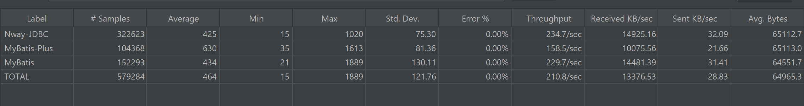
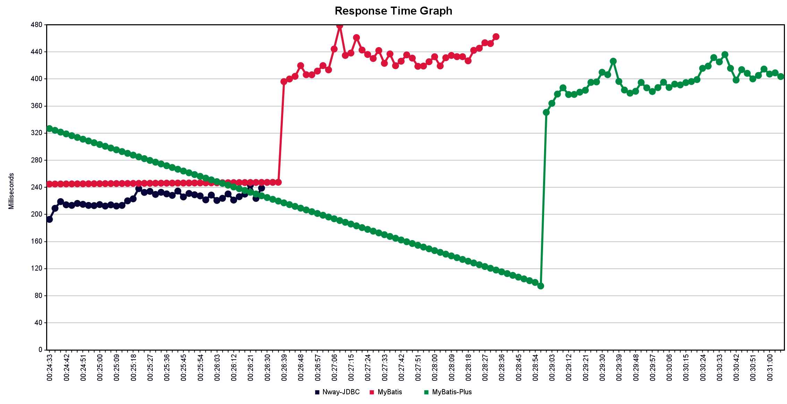

Nway-JDBC提供了高性能简单易用的单表操作方法，支持新增、修改时自动填充数据，支持单字段多值时自动保存、查询（如多选字典项），支持数据权限的管控、逻辑删除等。
使用时只需要给主类SqlExecutor配置好数据源，不需要继承某个类，也不需要实现哪个接口，工具类式使用。

性能对比（持续补充中，测试代码为vs-java项目，测试工具JMeter）

如上图所示，本工具的每秒吞吐量与MyBatis大致相当，比MyBatis-Plus高出约50%，内存占用比MyBatis-Plus低30%左右（内存占用参考top -p的res）。
测试数据可能因环境而异，但从多台机器不同版本jdk的测试情况看，性能明显优于同类型的MyBatis-Plus，内存占用也明显低于MyBatis-Plus。

本工具与mybatis定位不同，本不应对比，之所以列出，一是想说明本单表操作后复合对象，与基于mybatis的外连接查询性能基本一致，但请自行搜索关于单表查询的优点。
关于MyBatis-Plus性能问题，我已两次向MyBatis-Plus社区提出，均未收到积极解决的态度，相反其创建者认可当前性能表现，所以，希望使用高性能的单表操作，可以考虑本工具。

本项目专注于单表操作，对于多表的情况可以考虑使用视图，但更建议使用MyBatis等其他擅长多表操作的工具。
对于有嵌套对象的情况，根据测试数据，使用本工具进行多次单表查询后复合对象，性能优于直接使用外连接由MyBatis自动组合嵌套对象的方式。

# 基本使用方法

maven

	<dependency>
		<groupId>com.github.zdtjss</groupId>
		<artifactId>nway-jdbc</artifactId>
		<version>1.5.0</version>
	</dependency>

基于xml配置的bean：

    <bean id="sqlExecutor" class="com.nway.spring.jdbc.SqlExecutor">
        <property name="dataSource" ref="dataSource"/>
    </bean>

Spring Boot：

    @Autowired
    private DataSource dataSource;

	@Bean
	public SqlExecutor createSqlExecutor() {
		return new SqlExecutor(dataSource);
	}

增、改、删：  

	SqlBuilder builder = SQL.insert(Class beanClass);
	SqlBuilder builder = SQL.delete(Class beanClass);
	SqlBuilder builder = SQL.update(Class beanClass);
	
	int effectCount = sqlExecutor.update(builder);

查询条件自动判空，省去不必要的判断代码，如：

    if(StringUtils.isBlank(user.getName)) {
        sqlBuilder.like(User::getName, user.getName());
    }

上述代码可直接写成：

    sqlBuilder.ignoreInvalid(true).like(User::getName, user.getName()); 

    工具内部会判断user.getName()的传值是否有效，只有有效时才会作为查询条件。关于有效的定义：非空值字符串、非空Collection、其他非null数值。
    您当然可以忽略自动判断。只需调用sqlBuilder.ignoreInvalid(false)，同样的调用sqlBuilder.ignoreInvalid(true)即恢复自动判断。
    **只应在传值为空时不做为条件的情况下使用ignoreInvalid(true)，否则将数据越权。默认为false**
   
单对象查询：
	
    SqlBuilder builder = SQL.query(User.class).eq(usrQuery::getStatus).like(usrQuery::getName);
    User user = sqlExecutor.queryBean(builder);
    User user = sqlExecutor.queryById(100, User.class);
    
    or
    
    User usr = sqlExecutor.queryForBean("select * from t_user where user_name like ? and status = ?", User.class, "abc", 1);
        
对象集查询：
	
    SqlBuilder builder = SQL.query(User.class).eq(usrQuery::getStatus).like(usrQuery::getName);
    List<User> users = sqlExecutor.queryList(builder);
    List<User> users = sqlExecutor.queryList(Arrays.asList(100), User.class);
    Map<String, User> userMap = queryListMap(builder, User::getId)
    Map<String, User> userMap = queryListMap(Arrays.asList(100), User.class, User::getId)
    
    or
    
    List<User> users = sqlExecutor.queryList("select * from t_user where user_name like ? and status = ?", User.class, 10000);
    
分页对象集查询：

    SqlBuilder builder = SQL.query(User.class).eq(usrQuery::getStatus).like(usrQuery::getName).orderBy(usrQuery::getId);
    Page<User> users = sqlExecutor.queryPage(builder, 1, 10);
    
    or
    
    Page<User> users = sqlExecutor.queryPage("select * from t_user where user_name like ? and status = ? order by id", new Object[]{ "abc", 1 }, 1, 10, User.class);
    
    //页面数据 List<T>
    users.getPageData();
    //页面数据条数
    users.getPageSize();
    //总数据条数
    users.getTotalCount()
    //页面大小
    users.getPageSize();
    //页数
    users.getPageCount();
    //当前页码
    users.getCurrentPage();
		
Map对象集分页：	
		
    Page<Map<String, Object>> users = sqlExecutor.queryPage("select * from user_name where id <> ? order by id", new Object[]{ "abc", 1 }, 1, 10);
    分页默认支持Oracle、Mysql、MariaDB，关于其他数据库的分页可以实现com.nway.spring.jdbc.pagination.PaginationSupport接口，通过com.nway.spring.jdbc.SqlExecutor.setPaginationSupport方法引入。

# 自动填充数据和数据权限支持

	应用场景： 
		1、数据权限可用于数据查询时自动限制可返回的数据
		2、自动填充功能可应用于统一处理数据的“创建人”、“修改人”、“创建时间”、“修改时间“等
	使用办法：
		查询对象对应属性加入注解 @Column(fillStrategy = TestFillStrategy.class, permissionStrategy = TestPermissionStrategy.class) 

    LogicFieldStrategy：基于fillStrategy、permissionStrategy实现的软删除。这两个属性有很大的想象空间。

# 关于深度自定义

    1、如果需要对执行SQL和参数深度干预，可以集成Spring的JdbcTemplate覆盖相关方法，然后通过SqlExecutor.setJdbcTemplate替换默认值。
    2、默认表字段和类属性的映射是通过反射完成，但提供了ASM的实现（AsmBeanProcessor），如果有更好的实现方案，可以实现接口BeanProcessor，然后通过SqlExecutor.setBeanProcessor替换默认值。
    注：理论上ASM性能应高于反射，但自测结果显示，差距并不明显，具体原因需要进一步定位。

# 数据库表与Java类的映射规则

   表名：
   @Table("t_user")
   默认表名和类名的对应规则是首字母小写，其余大小字母变小写，前面加下划线。如UserRole默认对应的表名为user_role。
   
   字段：
   类属性和表列默认的对应规则是：删除下划线后首字符大写。表字段user_name对应属性userName，会通过类中setUserName方法赋值。
   也可以通过com.nway.spring.jdbc.annotation.Column修改默认规则。
    例：
   
      import com.nway.spring.jdbc.annotation.Table;
      import com.nway.spring.jdbc.annotation.Column;
      
      @Table("t_user")
      public class User {
        @Column(type = ColumnType.ID)
        private Integer id;
      	@Column("user_name")
	  	private String name;
	  	private int status;
        @Column(type = ColumnType.MULTI_VALUE, name = "power")
        private List<String> powerList;
      }

对于ColumnType.MULTI_VALUE类型的字段，程序自动从所属类表名加当前字段名命名的表里读写，上述powerList数据对应的表为t_user_power，其表结构为

    CREATE TABLE `t_computer_user` (
        `pk_id` int NOT NULL,               --固定字段，主键
        `foreign_key` int DEFAULT NULL,     --固定字段，主表主键
        `power` varchar(255) DEFAULT NULL,  --固定字段，@Column配置的字段名（遵从默认下划线命名规则）
        `idx` int DEFAULT NULL,             --固定字段，排序用
        PRIMARY KEY (`pk_id`)
    );

#对于JdbcTemplate.handleWarnings()，当日志级别为debug或trace时比较耗时（这是比较早的测试数据，默认可以忽略，发现性能较差时，可以考虑此问题是否存在）。

# 查询不到数据时

 <ul>
  <li>query返回null</li>
  <li>queryList返回值size() == 0</li>
  <li>queryPage返回值getTotal() == 0</li>
 </ul>

# 性能测试

各种情况下的性能均不输给当前主流的其他工具

    OrderPerformanceTest 单线程顺序执行时的性能测试类
    ConcurrentPerformanceTest   多线程并发模式下的性能测试类