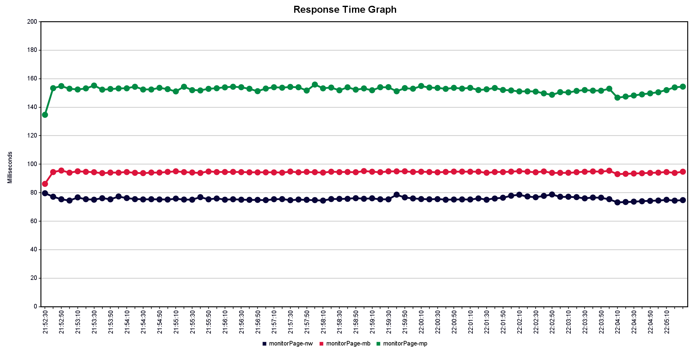
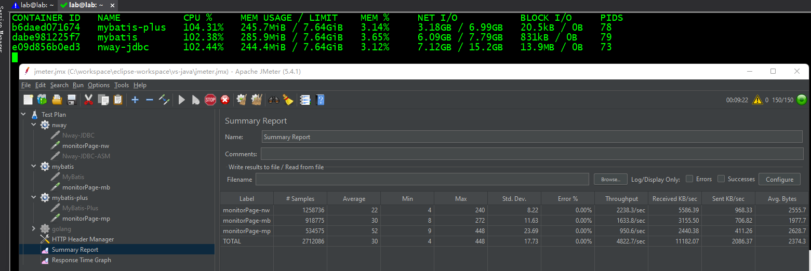
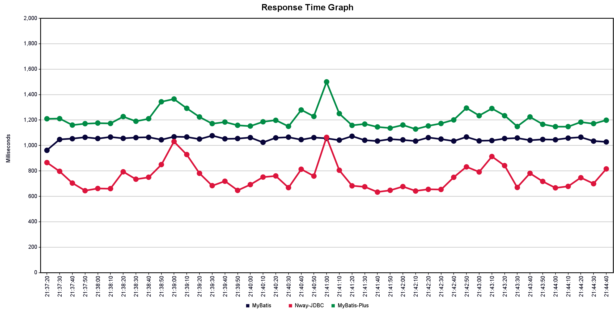
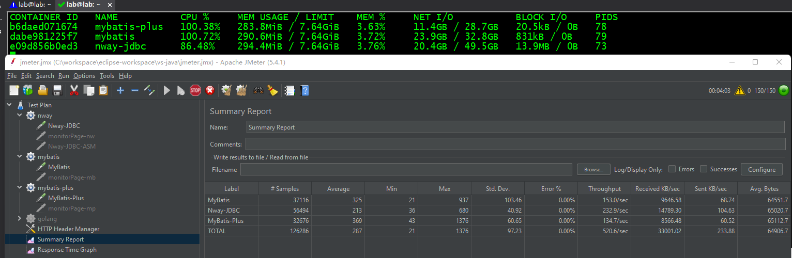

# Nway JDBC

**简单、易用、易扩展、性能不输给 MyBatis、明显高于 MyBatis-Plus 的单表操作工具。**

Nway JDBC 是一个基于 Spring JdbcTemplate 的单表操作工具，以工具类的方式使用：只需要给主类 `SqlExecutor` 配置好数据源即可，不需要继承某个类，也不需要实现某个接口。

> 本项目更新频率明显降低，并非预示着放弃维护，而是在设定的场景下暂无考虑支持的新特性，且也暂未发现 bug，但欢迎大家积极提问，定将竭力修复。

## 特性

- **零侵入**：无需继承类、实现接口或编写 Mapper XML，配置数据源即可使用；
- **Lambda 表达式构建 SQL**：类型安全的条件构造，避免硬编码字段名；
- **条件自动判空**：查询条件自动忽略无效值（null、空集合、空字符串），省去大量 if 判断；
- **自动填充**：新增、修改时自动填充数据（如主键生成、创建人/修改人、创建时间/修改时间等）；
- **数据权限**：查询、修改、删除时自动附加权限条件，支持按字段配置策略；
- **逻辑删除**：基于填充策略与权限策略的组合实现，开箱即用；
- **单字段多值**：多选字典项等一个字段对应多个值的场景，自动保存与查询；
- **分页查询**：内置 Oracle、MySQL、MariaDB 分页支持，其他数据库可自行扩展；
- **高性能**：元数据缓存、SQL 类型缓存，查询性能不输 MyBatis，明显高于 MyBatis-Plus。

支持 JDK 8、11、17、21。

## 快速开始

### Maven 依赖

```xml
<dependency>
    <groupId>com.github.zdtjss</groupId>
    <artifactId>nway-jdbc</artifactId>
    <version>1.7.6</version>
</dependency>
```

### 配置 SqlExecutor

基于 XML 配置的 bean：

```xml
<bean id="sqlExecutor" class="com.nway.spring.jdbc.SqlExecutor">
    <property name="dataSource" ref="dataSource"/>
</bean>
```

Spring Boot：

```java
@Autowired
private DataSource dataSource;

@Bean
public SqlExecutor createSqlExecutor() {
    return new SqlExecutor(dataSource);
}
```

## 实体映射

### 映射规则

**表名**：使用 `@Table` 注解指定表名。未指定时，默认规则为驼峰转下划线，如 `UserRole` 默认对应表 `user_role`。

**字段**：默认规则为下划线转驼峰，表字段 `user_name` 对应属性 `userName`，读取时通过 `setUserName` 方法赋值。也可以使用 `@Column` 修改默认规则。

### 注解说明

| 注解 | 作用域 | 说明 |
| --- | --- | --- |
| `@Table(name)` | 类 | 指定表名 |
| `@Column` | 属性 | 指定列名、列类型、填充策略、权限策略、多值子表信息 |
| `@MultiColumn` | 属性 | 自定义多值字段子表的表名及字段名 |

`@Column` 的 `type` 属性取值（`ColumnType`）：

| 取值 | 说明 |
| --- | --- |
| `COMMON` | 默认值，普通字段 |
| `ID` | 主键字段 |
| `IGNORE` | 忽略该属性，不参与数据库读写 |
| `MULTI_VALUE` | 单字段多值（如多选字典项），数据保存在独立的子表中 |

### 示例

```java
import com.nway.spring.jdbc.annotation.Table;
import com.nway.spring.jdbc.annotation.Column;
import com.nway.spring.jdbc.annotation.enums.ColumnType;

@Table("t_user")
public class User {

    @Column(type = ColumnType.ID)
    private Integer id;

    @Column("user_name")
    private String name;

    private int status;

    @Column(name = "power", type = ColumnType.MULTI_VALUE)
    private List<String> powerList;

    // getter / setter ...
}
```

> 域对象不建议使用基本类型，因为新增或修改数据时通常根据属性是否为 null 判断是否需要保存。

## 增删改

### 通过对象操作

```java
// 单条新增（属性为 null 的字段不参与 insert）
int count = sqlExecutor.insert(user);

// 批量新增
int count = sqlExecutor.batchInsert(userList);

// 按主键更新（属性为 null 的字段不参与 update）
int count = sqlExecutor.updateById(user);
// 按主键更新指定字段
int count = sqlExecutor.updateById(user, User::getName, User::getStatus);

// 批量按主键更新
int count = sqlExecutor.batchUpdateById(userList);

// 按主键删除
int count = sqlExecutor.deleteById(id, User.class);
// 批量按主键删除
int count = sqlExecutor.batchDeleteById(ids, User.class);
```

### 通过 SQL 构造器操作

```java
import com.nway.spring.jdbc.sql.SQL;

// 新增
InsertBuilder insertBuilder = SQL.insert(User.class).use(user);
// 删除
DeleteBuilder deleteBuilder = SQL.delete(User.class).eq(User::getStatus, 0);
// 更新
UpdateBuilder updateBuilder = SQL.update(User.class)
        .set(User::getStatus, 1)
        .eq(User::getId, 100);

int effectCount = sqlExecutor.update(insertBuilder);
int effectCount = sqlExecutor.update(deleteBuilder);
int effectCount = sqlExecutor.update(updateBuilder);
```

`UpdateBuilder` 还支持数值字段自增：

```java
SQL.update(User.class).increase(User::getLoginCount).eq(User::getId, 100);
```

批量更新：

```java
// 同一组参数批量执行
BatchUpdateBuilder batchUpdateBuilder = SQL.batchUpdate(User.class)
        .set(User::getStatus, 1)
        .use(userList);
int count = sqlExecutor.batchUpdate(batchUpdateBuilder);
```

## 查询

### 单对象查询

```java
QueryBuilder builder = SQL.query(User.class)
        .eq(User::getStatus, query.getStatus())
        .like(User::getName, query.getName());
User user = sqlExecutor.queryBean(builder);

User user = sqlExecutor.queryById(100, User.class);

// 原生 SQL
User user = sqlExecutor.queryForBean(
        "select * from t_user where user_name like ? and status = ?", User.class, "abc", 1);
```

`queryFirst` 与 `queryOne` 基于分页原理减少数据扫描，适用于从大量数据中通过非索引字段查询预期单行数据的场景：

- `queryFirst`：只取第一条，满足条件的数据不止一条时可能返回非预期数据，适合查最新一条记录；
- `queryOne`：当查询到多条数据时抛出异常。

### 集合查询

```java
QueryBuilder builder = SQL.query(User.class)
        .eq(User::getStatus, query.getStatus())
        .like(User::getName, query.getName());

List<User> users = sqlExecutor.queryList(builder);
List<User> users = sqlExecutor.queryList(Arrays.asList(100, 101), User.class);

// 查询后按 key 映射为 Map
Map<Integer, User> userMap = sqlExecutor.queryListMap(builder, User::getId);

// 原生 SQL
List<User> users = sqlExecutor.queryList(
        "select * from t_user where user_name like ? and status = ?", User.class, "abc", 1);
```

### 分页查询

```java
QueryBuilder builder = SQL.query(User.class)
        .eq(User::getStatus, query.getStatus())
        .like(User::getName, query.getName())
        .orderBy(User::getId);
Page<User> page = sqlExecutor.queryPage(builder, 1, 10);

// 原生 SQL + Bean
Page<User> page = sqlExecutor.queryPage(
        "select * from t_user where user_name like ? and status = ? order by id",
        new Object[]{ "abc", 1 }, 1, 10, User.class);

// 原生 SQL + Map
Page<Map<String, Object>> page = sqlExecutor.queryPage(
        "select * from t_user where id <> ? order by id", new Object[]{ 0 }, 1, 10);
```

`Page` 提供的常用方法：

```java
page.getPageData();    // 页面数据 List<T>
page.getTotalCount();  // 总数据条数
page.getPageSize();    // 页面大小
page.getPageCount();   // 总页数
page.getCurrentPage(); // 当前页码
```

分页默认支持 Oracle、MySQL、MariaDB。其他数据库可实现 `com.nway.spring.jdbc.pagination.PaginationSupport` 接口，通过 `SqlExecutor.setPaginationSupport` 方法引入。

### 统计与存在性判断

```java
int count = sqlExecutor.count(SQL.query(User.class).eq(User::getStatus, 1));

boolean exist = sqlExecutor.exist(SQL.query(User.class).eq(User::getName, "张三"));
```

### 查询不到数据时

- `queryBean` 返回 null；
- `queryList` 返回值 size() == 0；
- `queryPage` 返回值 getTotalCount() == 0。

## 条件构造

所有条件方法均支持三种写法：Lambda 方法引用（`User::getName` + 值）、Lambda 属性引用（`user::getName`，字段名与值均由方法引用推导）、字符串列名（`"user_name"` + 值）。

支持的条件方法：

`eq`、`ne`、`gt`、`ge`、`lt`、`le`、`like`、`notLike`、`likeLeft`、`likeRight`、`isNull`、`isNotNull`、`between`、`notBetween`、`in`、`notIn`、`and`、`or`。

### 条件自动判空

查询条件自动判空，省去不必要的判断代码：

```java
// 传统写法
if (StringUtils.isNotBlank(user.getName())) {
    sqlBuilder.like(User::getName, user.getName());
}

// 等价的简写
sqlBuilder.ignoreInvalidDeep(true).like(User::getName, user.getName());
```

- 工具内部会判断传值是否有效，只有有效值才会作为查询条件，`null`、空集合、空字符串均为无效值（基本类型的默认值是有效值）；
- 如果只需要忽略 `null` 或空集合，可以使用 `ignoreInvalid(true)`；
- 默认为 `false`，即不自动判空。只应在"传值为空时不作为条件"的场景下开启自动判空，否则可能导致数据越权；
- 在 `and(Consumer)` 或 `or(Consumer)` 中使用此特性时，需要在子条件中明确指定，如：

```java
builder.and(sql -> sql.ignoreInvalidDeep(true).like(User::getName, user.getName()));
```

### 括号与 or

```java
SQL.query(User.class)
   .eq(User::getStatus, 1)
   .and(sql -> sql.like(User::getName, "张").or().like(User::getName, "李"))
   .or(sql -> sql.eq(User::getAge, 18));
```

### 排序、分组与其他

```java
SQL.query(User.class)
   .distinct()                          // select distinct
   .withColumn(User::getId, User::getName) // 只查询指定字段
   .excludeColumn("password")           // 排除指定字段
   .eq(User::getStatus, 1)
   .groupBy(User::getDeptId)
   .having(sql -> sql.gt("count(*)", 10))
   .orderByDesc(User::getCreateTime)
   .andOrderByAsc(User::getId);
```

### 忽略数据权限

实体配置了数据权限策略后，如需在某次查询中跳过权限限制：

```java
QueryBuilder builder = SQL.query(User.class).eq(User::getStatus, 1);
builder.ignorePermission();
```

## 单字段多值

对于 `ColumnType.MULTI_VALUE` 类型的字段，程序自动从"所属类表名 + 当前字段名"命名的子表里读写。上述示例中 `powerList` 对应的子表为 `t_user_power`，其表结构为：

```sql
CREATE TABLE `t_user_power` (
    `id` bigint NOT NULL,               -- 固定字段，主键
    `fk` int DEFAULT NULL,              -- 固定字段，主表主键，类型可根据主表主键类型定义
    `power` varchar(255) DEFAULT NULL,  -- 固定字段，@Column 配置的字段名（遵从默认下划线命名规则）
    `idx` int DEFAULT NULL,             -- 固定字段，排序用
    PRIMARY KEY (`id`)
);
```

使用 `@MultiColumn` 可以自定义子表名及字段名：

```java
@Column(name = "mv", type = ColumnType.MULTI_VALUE)
@MultiColumn(table = "t_user_mv", key = "pk_id", fk = "foreign_key", idx = "seq")
private List<String> mvList;
```

多值字段的读写：

```java
// 保存时多值字段随主对象自动保存（insert / updateById / batchInsert / batchUpdateById）
user.setPowerList(Arrays.asList("read", "write"));
sqlExecutor.insert(user);

// 查询时通过 withMVColumn 指定需要加载的多值字段
QueryBuilder builder = SQL.query(User.class).eq(User::getId, 100)
        .withMVColumn(User::getPowerList);
List<User> users = sqlExecutor.queryList(builder);

// 按多值字段的值筛选主表数据（自动 join 子表）
QueryBuilder builder = SQL.query(User.class).mvIn(User::getPowerList, Arrays.asList("read"));
```

多值字段更新遵循 **null 忽略、empty 清空** 的策略：属性为 null 时不修改，属性为空集合时清空子表数据。

## 自动填充与数据权限

**应用场景**：

1. 自动填充：统一处理数据的"创建人""修改人""创建时间""修改时间"、主键生成等；
2. 数据权限：查询、修改、删除时自动限制可操作的数据范围。

**使用办法**：在实体属性上通过 `@Column` 注解配置策略类：

```java
@Column(fillStrategy = MyFillStrategy.class, permissionStrategy = MyPermissionStrategy.class)
private String createBy;
```

自定义策略分别实现 `com.nway.spring.jdbc.sql.fill.FillStrategy` 与 `com.nway.spring.jdbc.sql.permission.PermissionStrategy` 接口。

**内置填充策略**：

| 策略类 | 说明 |
| --- | --- |
| `NumberIdStrategy` | 数值型主键生成（雪花算法） |
| `StringIdStrategy` | 字符串型主键生成（雪花算法） |
| `UuidStrategy` | UUID 主键生成 |
| `LocalDateTimeNow` | 新增和更新时填充当前时间 |
| `LocalDateTimeNowOnInsert` | 仅新增时填充当前时间 |

**逻辑删除**：`LogicFieldStrategy` 是基于 fillStrategy、permissionStrategy 实现的软删除（Boolean 标记），`LogicFieldIntStrategy` 是 int 标记类型的实现。用法示例：

```java
@Column(fillStrategy = LogicFieldStrategy.class, permissionStrategy = LogicFieldStrategy.class)
private Boolean delFlag;
```

配置后，`delete` 操作自动转为更新删除标记，查询自动附加"未删除"条件。这两个属性有很大的想象空间，可自行组合扩展。

## 深度自定义

1. 如果需要对执行的 SQL 和参数深度干预，可以继承 Spring 的 `JdbcTemplate` 覆盖相关方法，然后通过 `SqlExecutor.setJdbcTemplate` 替换默认值；
2. 默认表字段和类属性的映射是通过反射完成的，但提供了 ASM 的实现（`AsmBeanProcessor`）。如果有更好的实现方案，可以实现 `BeanProcessor` 接口，然后通过 `SqlExecutor.setBeanProcessor` 替换默认值：

```java
sqlExecutor.setBeanProcessor(new AsmBeanProcessor());
```

注：ASM 为 provided 依赖，使用 `AsmBeanProcessor` 时需要在项目中自行引入 `org.ow2.asm:asm`。理论上 ASM 性能应高于反射，但自测结果显示差距并不明显，具体原因需要进一步定位。

## 性能测试

各种情况下的性能均不输给当前主流的其他工具：

- `OrderPerformanceTest`：单线程顺序执行时的性能测试类；
- `ConcurrentPerformanceTest`：多线程并发模式下的性能测试类。

性能对比（测试代码为 vs-java 项目，测试工具 JMeter）：





上图为分页查询性能对比，本工具 TPS 比 MyBatis-Plus 高出约 1 倍，比 MyBatis 高出约 20% 多。





上图为列表查询性能对比，本工具 TPS 比 MyBatis-Plus 高出约 60%，比 MyBatis 高出约 40%。

测试数据可能因环境而异，但从多台机器不同版本 JDK 的测试情况看，性能明显优于同类型的 MyBatis-Plus。

本工具与 MyBatis 定位不同，本不应对比，之所以列出，一是想说明本工具单表操作后复合对象，其性能不比基于 MyBatis 的外连接查询性能差。

本项目专注于单表操作，对于多表的情况可以考虑使用视图，也可以使用 MyBatis 等其他擅长多表操作的工具。对于有嵌套对象的情况，根据测试数据，使用本工具进行多次单表查询后复合对象，性能优于直接使用外连接由 MyBatis 自动组合嵌套对象的方式。

## 其他说明

- 关于 `JdbcTemplate.handleWarnings()`：当日志级别为 debug 或 trace 时比较耗时（这是比较早的测试数据，默认可以忽略，发现性能较差时可以考虑此问题是否存在）；
- `appendCondition` 直接拼接 SQL 片段，如果包含用户输入值，则存在 SQL 注入的风险，请谨慎使用。

## License

[Apache License 2.0](LICENSE)
